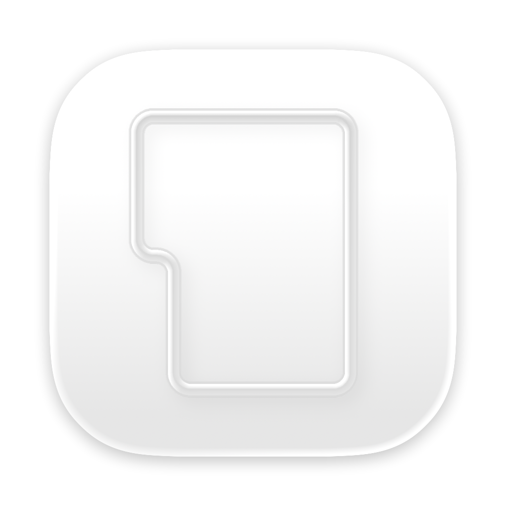
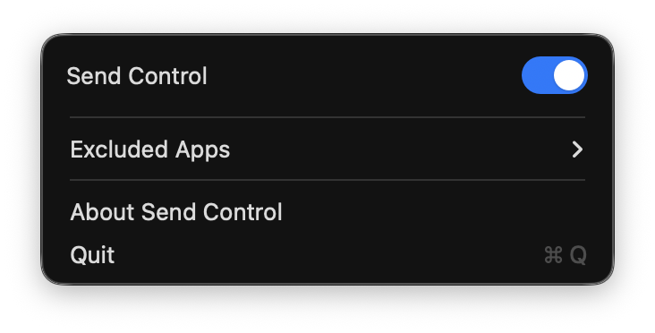

  

<h1 align="center">Send Control</h1>

  macOS menu bar utility that swaps Return ↔ Shift+Return at the system level.
   
  <a href="README.ja.md">日本語</a>

  
  
  
  
  
  

## What It Does

Send Control intercepts Return key events via a CGEvent tap and swaps them:

- **Return** → Shift+Return (sends message without newline in chat apps)
- **Shift+Return** → Return (inserts newline)

Works system-wide. Configure per-app exclusions from the menu bar.

## Download

<a href="https://github.com/u23ken/send-control/releases/latest">
  <strong>⬇ Download latest release</strong>
</a>

Signed with Developer ID and notarized by Apple — no Gatekeeper warnings.

## Install

1. Download `Send-Control-v*.zip` from [Releases](https://github.com/u23ken/send-control/releases)
2. Unzip and move `Send Control.app` to `/Applications/`
3. Launch and grant two permissions:
   - **Accessibility** (`System Settings > Privacy & Security > Accessibility`)
   - **Input Monitoring** (`System Settings > Privacy & Security > Input Monitoring`)

See [INSTALL.md](INSTALL.md) for detailed steps.

## Features

- Swaps Return ↔ Shift+Return at the CGEvent tap layer
- Per-app exclusion list (configurable from menu bar)
- Terminal-safe mode for apps using modifyOtherKeys / kitty protocol
- Permission guide UI for first-time setup
- Health check with automatic event tap recovery
- Single-instance enforcement
- ~1400 LOC, pure AppKit, no dependencies

## Requirements

- macOS 13 (Ventura) or later
- Accessibility and Input Monitoring permissions
- Not available on Mac App Store (CGEvent tap is incompatible with App Sandbox)

## Documents

| | English | 日本語 |
|---|---|---|
| Install | [INSTALL.md](INSTALL.md) | [INSTALL.ja.md](INSTALL.ja.md) |
| Privacy | [PRIVACY.md](PRIVACY.md) | [PRIVACY.ja.md](PRIVACY.ja.md) |
| Known Issues | [KNOWN_ISSUES.md](KNOWN_ISSUES.md) | [KNOWN_ISSUES.ja.md](KNOWN_ISSUES.ja.md) |
| Quick Start | — | [QUICKSTART_BEGINNER.ja.md](QUICKSTART_BEGINNER.ja.md) |

## License

[Apache-2.0](LICENSE)
